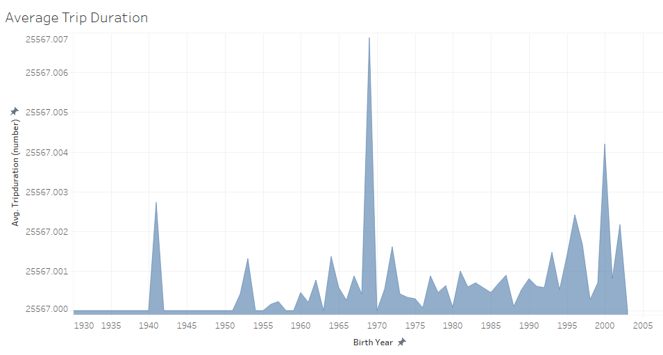
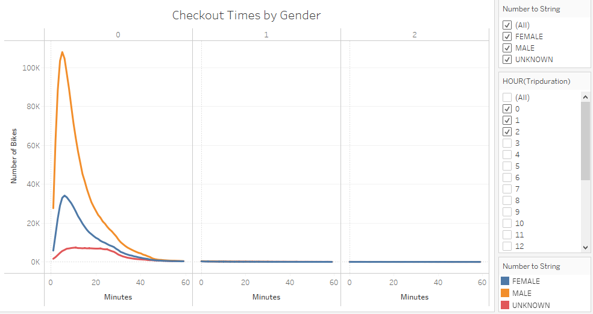
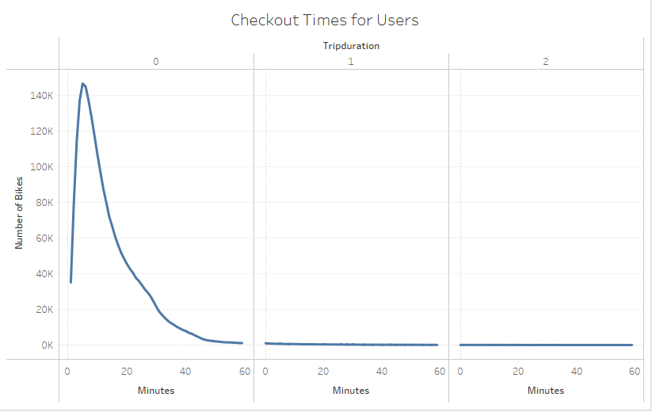
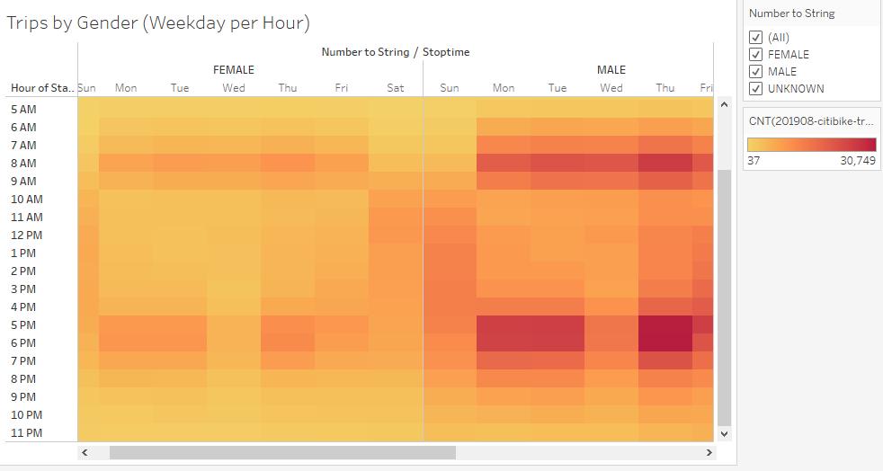
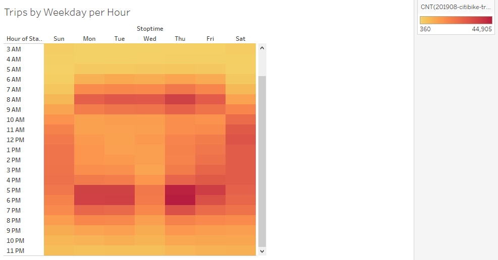
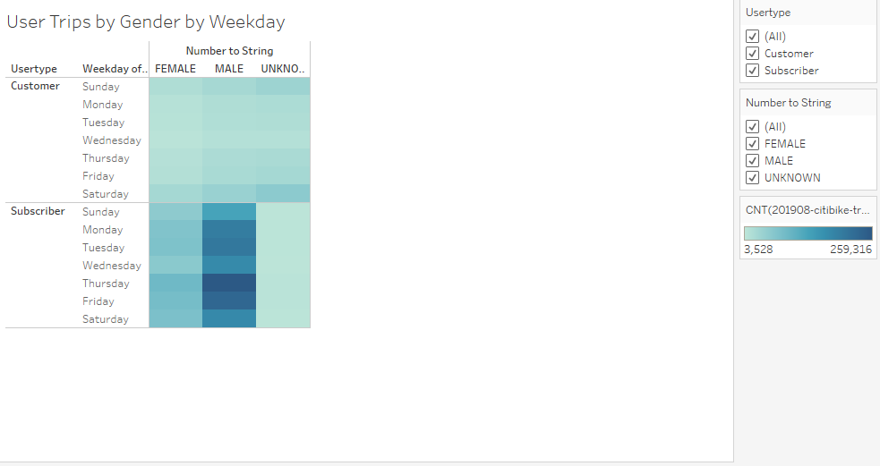

# bikesharing

## Project Overview
The goal of this project is to provide data analysis to support a proposal to bring a bike-sharing business to Des Moines, IA. With a potential and interested investor who might be interested in providing seed funding for a bike-sharing program in Des Moines, we are preparing to create a proposal for how this service might operate in Des Moines based off of bike-sharing data we've gathered from New York City.

## Results

This bar graph depicts the frequency of rides taken based on the starttime hour of the ride. So, a ride that begins at 11am corresponds to the "Hour of Starttime" on the vertical axis. Hour 20 corresponds to 8pm. Apparently, the busiest hour of the day for rides starting is at 5pm, with about 225,000 rides starting at 5pm throughout all the month of August 2019.

This graph shows the average bike trip duration based on birth year of the bike-sharing customer. The vertical axis represents time for trip duration. The horizontal axis represents birth year of the riding customer. Generally speaking, younger riders tend to ride for longer. This is great news for bike-riding prospects in Des Moines, IA, as the average age in Des Moines is 34.2 years. Meanwhile, the average age in New York City is 36.7 years. Given this knowledge, the proportion of citizens likely to ride bikes around town than not is higher compared to those who may potentially bike in New York City.   

This line graph shows the breakdown of trip durations by gender. Most rides appear to last for under 20 minutes. Further, most riders tend to be men, then women, and finally 'other' riders. Very few rides last an hour, and virtually none last for over two hours.

This line graph is similar to the one above. It is simply an aggregate line graph of all users and their trip durations.

This visual depicts which genders tend to ride the most, based on both hour of the day and the day of the week, using a heatmap. The legend for this map is seen on the right side of the visual. The more red the area, the more Citi bikes were used in that time window.

Similar to the visual above, this depiction represents the time of day and the day of the week the most rides occur in. Typically, across the week, rides pick up in the evening hours. They tend to especially peak on Thursdays.

This heatmap visual shows a breakdown between Citi bike subscriber bikers and single-use rider customers in the city. It shows the frequency of rides broken down by genders and the days of the week. Intuitively, more rides are taken by subscribers who plan to bike regularly. Interestingly, most riders appear to be men and they appear to take rides the most on Thursdays.

## Summary
Overall, we can draw some broad conclusions. Most bike riders appear to be men. Most riders ride on Thursdays, a lot tend to keep riding throughout the weekend, and the fewest amount of rides occurs during the early start of the week. Given that the age and gender demographics of Des Moines and NYC appear to be similar, we can gravitate toward thinking that ride patterns in Des Moines will appear similar to those riding patterns in NYC. The most major difference between these two cities in demographics is the sheer population size of these cities. That said, a Des Moines Citi bike planning committee could plan to install as many bike stations around the city at a proportional rate of how many users there are in New York City as there is to population in New York City.

With the given dataset, two more visualizations I would like to be able to create are, first, a geographic map of Des Moines and population density throughout the city. With this, we could have a lot of insight and allow for sound decision-making in regards of good potential posts to install bike racks and stations. These would be the ideal spots to host bikes while they aren't being ridden, and where from repairs could be made upon the bikes. Second, a visual depicting a difference in where subscribers use bikes versus the whereabouts of where single-use customers use their bikes could offer additional insight as to good spots where bike stations could be placed throughout the city. Because subscribers use the bikes most frequently, ensuring their access to bike spots is critical to maintaining their subscriptions to the bike-ride-sharing Citi bike service. Thus, another geographical map with a breakdown between single-use customers and subscribers and their regular starting locations could help us start to postulate where in Des Moines the best place to set up bike stations would be.